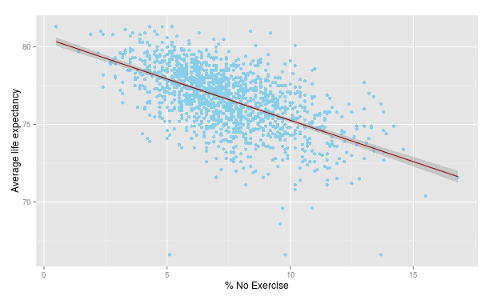

## Application Overview

The "Average Life Expectancy Visualization and Prediction" app uses data obtained from the [Community Health Status Indicators Dataset](https://catalog.data.gov/dataset/community-health-status-indicators-chsi-to-combat-obesity-heart-disease-and-cancer) to visualize and predict average life expectancy of communities.

The dataset created for this application consists of the following variables:
* No_Exercise - the percentage of people in the community that don't exercise.
* Few_Fruit_Veg - the percentage of people in the community that eat few fruit and vegetables.
* Obesity - the percentage of people in the community that are obese.
* High_Blood_Pres - the percentage of people in the community that have high blood pressure.
* Smoker - the percentage of people in the community that smoke.
* Diabetes - the percentage of people in the community that suffer from diabetes.
* ALE - the average life expectancy of the community.

---

## Data Preprocessing

First data is loaded from two files: 'SUMMARYMEASURESOFHEALTH.csv' and 'RISKFACTORSANDACCESSTOCARE.csv' from the Community Health Status Indicators Dataset. Next the data is merged into one dataset and subsetted to contain only variables of interest. The last step is removing missing
values from the dataset (-1111.1 and -2222.2 are codes for missing values in the original dataset). The data is saved into a csv file.


```r
measures <- read.csv('./data/SUMMARYMEASURESOFHEALTH.csv')
risk <- read.csv('./data/RISKFACTORSANDACCESSTOCARE.csv')
all.data <- merge(risk, measures)
data <- subset(all.data, select = c('No_Exercise', 'Few_Fruit_Veg', 'Obesity',
  'High_Blood_Pres', 'Smoker', 'Diabetes', 'ALE'))
data[data == -1111.1] <- NA
data[data == -2222.2] <- NA
data <- na.omit(data)
write.csv(data, file = "./data/data.csv")
```

---

## Visualization

In the "Visualization" tab the application displays the relationship between
a selected explanatory variable and the predictor variable (ALE).
The user selects an explanatory variable by clicking on a radio button. The
appropriate plot is displayed. The following plot is an example plot from the app and visualizes the relationship between the percentage of people that don't exercise and average life expectancy of the community.



---

## Prediction


In the "Prediction" tab users can predict Average Life Expectancy by setting
values of risk factors.
The model has been fitted using the "lm" function. The best model was
selected using the "step" function. The final model uses No_Exercise, Obesity, High_Blood_Pres, Smoker and Diabetes as predictors. The Few_Fruit_Veg 
is not significant and thus is not used in the model.


```r
max.model <- lm(ALE ~ ., data = data)
model <- step(max.model, data = data, trace=0)
model$coefficients
```

```
##     (Intercept)     No_Exercise         Obesity High_Blood_Pres 
##     84.90372205     -0.08814167     -0.06799012     -0.02894685 
##          Smoker        Diabetes 
##     -0.10846757     -0.14089844
```
